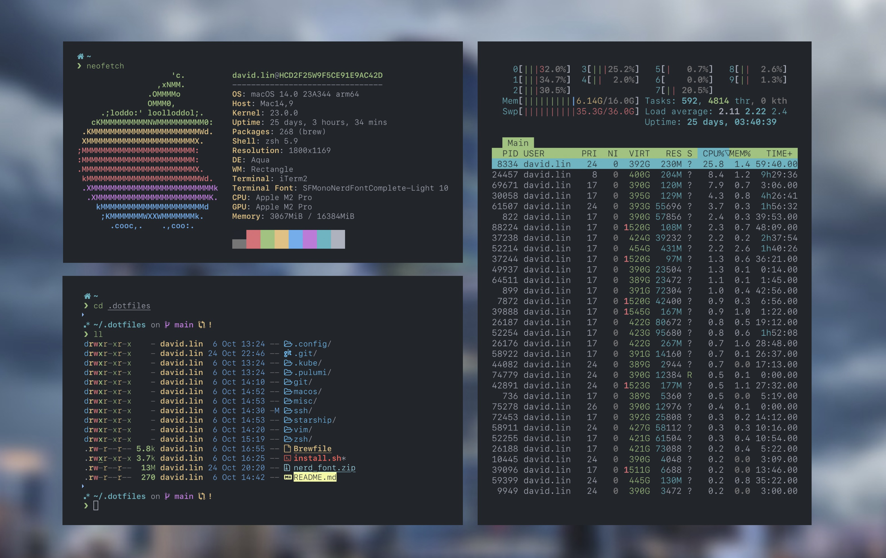

# My Dotfiles for macOS



## Core Configurations

- [`Brewfile`](Brewfile) binaries and apps to be installed with [Brew](https://brew.sh/)
- [`git/gitconfigs`](./git/gitconfigs/) git configurations
- [`macos/defaults.sh`](macos/defaults.sh) macOS defaults
- [`zsh/custom/plugins.zsh`](zsh/custom/plugins.zsh), [`zsh/custom/aliases.zsh`](zsh/custom/aliases.zsh), and [`zsh/custom/functions.zsh`](zsh/custom/functions.zsh)

## Usage

Ensure that you have [Homebrew](https://brew.sh/) installed before running the install script.

If you use [1password](https://1password.com/), you'll need to symlink the agent socket:

```sh
mkdir -p ~/.1password && ln -s ~/Library/Group\ Containers/2BUA8C4S2C.com.1password/t/agent.sock ~/.1password/agent.sock
```

Clone and run the install script:

```sh
git clone https://github.com/davidlhw/dotfiles-public.git ~/.dotfiles
cd ~/.dotfiles
./install.sh
```

## Terminal Font

Install fonts from zip at [`starship/nerd_font.zip`](./starship/nerd_font.zip) or from [nerd-fonts](https://www.nerdfonts.com/). See configuration in [`starship/starship.toml`](./starship/starship.toml).

For vscode, see [vscode terminal appearance configurations](https://code.visualstudio.com/docs/terminal/appearance).

## Credits

Largely inspired by:

- [jakejarvis](https://github.com/jakejarvis/dotfiles)
- [probberechts](https://github.com/probberechts/dotfiles)
- [holman](https://github.com/holman/dotfiles)
